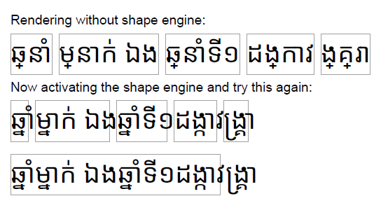
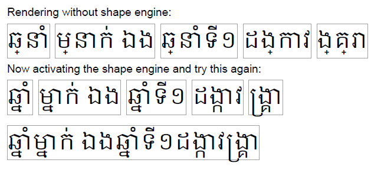

# text-shaping

Test environment for rendering Asian fonts. Select the correct scriptag of [173 scripts](https://learn.microsoft.com/en-us/typography/opentype/spec/scripttags) and then the correct language tag for one of the [634 possible languages](https://learn.microsoft.com/en-us/typography/opentype/spec/languagetags) used.

``` py
pdf.set_text_shaping(use_shaping_engine=True, script="khmr", language="khm")
```

## Khmer

With Noto fonts the returned width does not match with the actual font width after being processed by a font shaper like harfbuzz. A result with NotoSansKhmer-regular looks like this:



The expected result is shown here with a Google font in Khmer regular:



## Sinhala

Getting there ...
