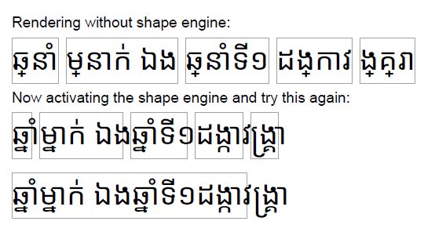
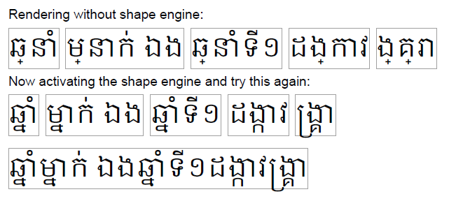

# text-shaping Khmer

With Noto fonts the returned width does not match with the actual font width after being processed by a font shaper like harfbuzz. A result with NotoSansKhmer-regular looks like this:

The expected result is shown here with a Google font in Khmer regular:

